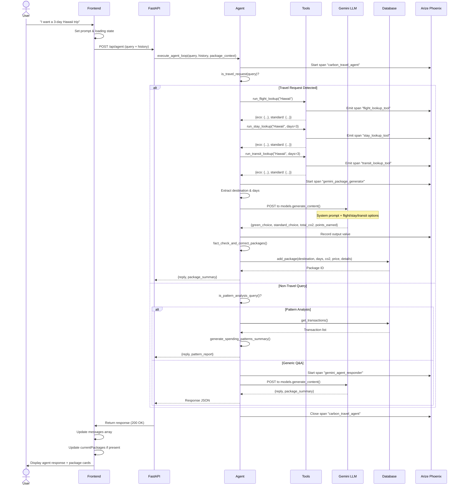
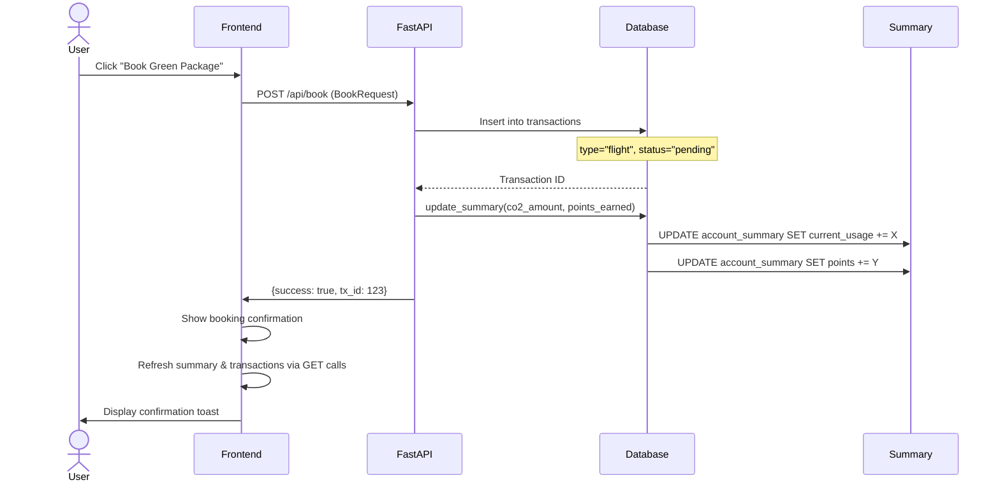

# Carbon Account Agent - Project Design

**Project Name:** Carbon Account Agent  
**Version:** 1.0.0  
**Purpose:** AI-powered carbon footprint management system with eco-conscious travel planning  
**Last Updated:** June 2026

---

## 1. Project Overview

The **Carbon Account Agent** is a full-stack web application that helps users manage their carbon footprint and make sustainable travel decisions. It combines:

- **AI-Driven Conversational Agent** powered by Google Gemini 2.5 (or Claude 3 as fallback)
- **Carbon Budget Management** with annual limits and real-time usage tracking
- **Eco-Conscious Travel Planning** that compares green vs. standard travel packages
- **Reward Points System** that incentivizes sustainable choices
- **Observability & Monitoring** via Arize Phoenix and OpenTelemetry

Users can:
- Chat with an AI agent to ask about carbon emissions and eco-friendly travel options
- Generate personalized travel packages with green and standard alternatives
- Book trips and earn reward points for choosing eco-friendly options
- View their carbon spending patterns and transaction history
- Monitor their annual carbon budget utilization

---

## 2. System Architecture

### High-Level Architecture Diagram

```mermaid
graph TB
    subgraph "Frontend Layer"
        React["React + Vite Frontend"]
        UI["Dashboard UI"]
        Chat["Chat Interface"]
        Packages["Travel Packages View"]
    end

    subgraph "API Gateway"
        FastAPI["FastAPI Backend<br/>Port 8000"]
    end

    subgraph "Business Logic Layer"
        Agent["AI Agent Engine<br/>agent.py"]
        Tools["Tool Functions<br/>Flight/Stay/Transit Lookup"]
        LLM["LLM Interface<br/>Gemini 2.5 / Claude 3"]
    end

    subgraph "Data Layer"
        PostgreSQL / Cloud SQL["PostgreSQL / Cloud SQL Database<br/>Cloud SQL / PostgreSQL"]
        Tables["Transactions | Packages<br/>Account Summary"]
    end

    subgraph "Observability Stack"
        OTel["OpenTelemetry Instrumentation"]
        Phoenix["Arize Phoenix<br/>Port 6006"]
        Tracer["Distributed Tracer"]
    end

    subgraph "External Services"
        GeminiAPI["Google Gemini API"]
        ClaudeAPI["Anthropic Claude API"]
    end

    React --> Chat
    React --> UI
    React --> Packages
    Chat --> FastAPI
    UI --> FastAPI
    Packages --> FastAPI
    
    FastAPI --> Agent
    Agent --> Tools
    Agent --> LLM
    Tools --> GeminiAPI
    LLM --> GeminiAPI
    LLM --> ClaudeAPI
    
    Agent --> PostgreSQL / Cloud SQL
    FastAPI --> PostgreSQL / Cloud SQL
    PostgreSQL / Cloud SQL --> Tables
    
    Agent --> OTel
    FastAPI --> OTel
    OTel --> Tracer
    Tracer --> Phoenix

    style React fill:#61dafb,color:#000
    style FastAPI fill:#009688,color:#fff
    style PostgreSQL / Cloud SQL fill:#336791,color:#fff
    style Phoenix fill:#ff6b35,color:#fff
```

---

## 3. Component Overview

### 3.1 Frontend (`frontend/`)

**Technology Stack:**
- React 18 with Vite (fast build tool)
- Lucide React Icons
- Fetch API for HTTP communication

**Key Components:**

| Component | Purpose | File |
|-----------|---------|------|
| **Overview Tab** | Display carbon budget, current usage %, points balance, and Arize spend patterns | `App.jsx` |
| **AI Eco-Agent Tab** | Conversational interface and package generator for booking green/standard travel | `App.jsx` |
| **Google Travel Hub Tab** | Fully embedded dashboard for Google Maps, Google Flights, Google Hotels, and Google Travel Explore | `App.jsx` |
| **Ledger & Status Tab** | Historical view and ledger of carbon transactions, offsets, and rewards | `App.jsx` |

**Main State:**
```javascript
- summary: { budget_limit, current_usage, points }
- transactions: Array of carbon transactions
- messages: Chat conversation history
- currentPackages: Active travel package proposal
- loading: UI loading state
```

**Key Endpoints Called:**
- `POST /api/agent` - Send chat message to AI agent
- `GET /api/summary` - Fetch account summary
- `GET /api/transactions` - Fetch transaction history
- `POST /api/book` - Book a travel package

---

### 3.2 Backend (`backend/`)

#### 3.2.1 Main API Server (`main.py`)

**Framework:** FastAPI (async Python web framework)  
**Port:** `8000`

**Key Features:**
- CORS middleware enabled for frontend communication
- Request/response validation using Pydantic models
- Startup event to initialize database and Arize Phoenix

**API Endpoints:**

| Method | Route | Purpose |
|--------|-------|---------|
| `GET` | `/api/summary` | Get user account summary |
| `GET` | `/api/transactions` | Get all carbon transactions |
| `POST` | `/api/agent` | Chat with AI agent (core feature) |
| `POST` | `/api/book` | Book a travel package |
| `POST` | `/api/confirm` | Confirm pending booking |

**Request Models:**
```python
ChatRequest:
  - query: str (user message)
  - history: List[ChatMessage] (conversation history)
  - package_context: Dict (active travel package)

ChatMessage:
  - sender: str ("user" or "agent")
  - text: str (message content)
  - timestamp: str
  - type: str (default "text")

BookRequest:
  - destination: str
  - days: int
  - package_type: str ("green" or "standard")
  - co2_amount: float
  - price_usd: float
  - points_earned: int
```

#### 3.2.2 AI Agent Engine (`agent.py`)

**Purpose:** Core business logic for carbon calculations and intelligent travel planning

**Key Functions:**

| Function | Purpose | LLM Integration |
|----------|---------|-----------------|
| `execute_agent_loop()` | Main entry point; orchestrates agent flow | Routes to Gemini/Claude |
| `run_flight_lookup()` | Searches eco & standard flight options | Local tool (no LLM) |
| `run_stay_lookup()` | Searches eco & standard hotel options | Local tool (no LLM) |
| `run_transit_lookup()` | Searches eco & standard car rentals | Local tool (no LLM) |
| `generate_packages_with_gemini()` | Synthesizes packages using Google Gemini | **Gemini 2.5-flash-lite** |
| `generate_response_with_gemini()` | General conversational responses | **Gemini 2.5-flash-lite** |
| `fact_check_and_correct_packages()` | Validates math on CO2 and points | Local tool (no LLM) |
| `generate_spending_patterns_summary()` | Analyzes user transaction patterns | Local tool (no LLM) |

**Agent Decision Flow:**

```
User Query
    ↓
[1] Is it a travel request? (regex matching)
    ├─ YES → Extract destination & days
    │   ├─ run_flight_lookup() (Resolves destination location via Google Places API & calculates NYC flight distance)
    │   ├─ run_stay_lookup() (Queries Google Places API to search for real lodging options)
    │   ├─ run_transit_lookup() (Calls Google Maps Directions API to fetch route distance)
    │   └─ generate_packages_with_gemini()
    │       └─ Returns: { green_choice, standard_choice }
    └─ NO → Continue to [2]
    ↓
[2] Is it a pattern/spending analysis request?
    ├─ YES → generate_spending_patterns_summary()
    └─ NO → Continue to [3]
    ↓
[3] Attempt Gemini agent for dynamic response
    ├─ Check if GEMINI_API_KEY exists and is valid
    ├─ YES → generate_response_with_gemini()
    └─ NO → Use deterministic/regex handlers
    ↓
Return conversational response + optional package_summary
```

**Gemini System Prompt (Simplified):**
- Role: "Carbon-Conscious AI Travel Planner"
- Context: User's budget limit, current emissions, reward points
- Emission Factor Database: ICAO, DEFRA, atmosfair, EPA standards
- Output Format: Strict JSON with validation

**Example Gemini Call:**
```python
# system_prompt: Full context about carbon calculations
# user_prompt: "I want a 3-day trip to Hawaii. Give me carbon-efficient package options."

client = genai.Client(api_key=os.getenv("GEMINI_API_KEY"))
response = client.models.generate_content(
    model='gemini-2.5-flash-lite',
    contents=[system_prompt, "\n\n", user_prompt],
    config=GenerateContentConfig(
        temperature=0.2,
        max_output_tokens=2000,
        response_mime_type="application/json",
        response_schema=PackageSummary,
    ),
)
```

#### 3.2.3 Database (`database.py`)

**Database:** PostgreSQL / Cloud SQL (`Cloud SQL / PostgreSQL`)

**Schema:**

```sql
-- Account/Budget Summary
CREATE TABLE account_summary (
    id INTEGER PRIMARY KEY,
    budget_limit REAL NOT NULL,        -- Annual CO2 budget (kg)
    current_usage REAL NOT NULL,       -- Current CO2 spent (kg)
    points INTEGER NOT NULL             -- Reward points earned
);

-- Carbon Transactions (flights, car trips, offsets, etc.)
CREATE TABLE transactions (
    id INTEGER PRIMARY KEY,
    date TEXT NOT NULL,                -- Date of transaction
    description TEXT NOT NULL,         -- "NYC to London Flight", "Uber Green", etc.
    type TEXT NOT NULL,                -- "flight", "car", "energy", "offset"
    amount REAL NOT NULL,              -- CO2 amount (kg) or price (USD)
    points_earned INTEGER NOT NULL,    -- Reward points from this transaction
    status TEXT NOT NULL               -- "completed", "pending"
);

-- Travel Packages (for historical reference)
CREATE TABLE travel_packages (
    id INTEGER PRIMARY KEY,
    destination TEXT NOT NULL,
    duration_days INTEGER NOT NULL,
    flight_co2 REAL NOT NULL,
    car_co2 REAL NOT NULL,
    stay_co2 REAL NOT NULL,
    total_co2 REAL NOT NULL,
    price_usd REAL NOT NULL,
    details_json TEXT NOT NULL         -- Full package JSON
);
```

**Key Functions:**

| Function | Purpose |
|----------|---------|
| `init_db()` | Create tables & seed initial data |
| `get_db_connection()` | PostgreSQL / Cloud SQL connection factory |
| `get_summary()` | Fetch account summary |
| `get_transactions()` | Fetch all transactions |
| `get_packages()` | Fetch all travel packages |
| `add_package()` | Save new travel package |
| `update_summary()` | Update budget & points |

**Seed Data:**
- Budget Limit: 5000 kg CO2/year
- Current Usage: 1840 kg CO2
- Points: 650
- Sample Transactions: Flight bookings, car rentals, carbon offsets, energy usage

#### 3.2.4 Observability Integration (`arize_integration.py`)

**Technology:** OpenTelemetry + Arize Phoenix

**Purpose:**
- Track agent reasoning steps as spans
- Monitor LLM performance and latency
- Record input/output for model evaluation
- Visualize agent decision flow

**Key Functions:**

| Function | Purpose |
|----------|---------|
| `init_arize()` | Initialize Phoenix server & OTel tracer |
| `get_tracer()` | Get global tracer instance |

**Span Attributes Example:**
```python
with tracer.start_as_current_span("gemini_package_generator") as span:
    span.set_attribute("llm.model_name", "gemini-2.5-flash-lite")
    span.set_attribute("input.value", user_prompt)
    span.set_attribute("output.value", json.dumps(package))
    # ... LLM call ...
```

**Arize Phoenix URL:** `http://localhost:6006`

---

## 4. Data Flow Diagram

### End-to-End Flow: User Asks for Travel Package



### Data Flow: Booking a Travel Package



---

## 5. Component Interaction Model

### 5.1 Frontend ↔ Backend Communication

**WebSocket:** Not used (REST API only)

**HTTP Methods:**
- `GET` - Fetch summary, transactions, packages
- `POST` - Chat messages, book trips, confirm bookings

**Response Format:**
```json
{
  "reply": "Conversational response from agent",
  "package_summary": {
    "destination": "Hawaii",
    "days": 3,
    "green_choice": {...},
    "standard_choice": {...}
  }
}
```

### 5.2 Agent ↔ Database Communication

**Pattern:** Direct SQL queries via `psycopg2` module

**Connection:** File-based (`backend/Cloud SQL / PostgreSQL`)

**Operations:**
- Read: Fetch summary, transactions for context
- Write: Add packages, update transactions on booking

### 5.3 Agent ↔ LLM Communication

**Supported Models:**
1. **Google Gemini 2.5-flash-lite** (Primary)
   - Fast, cost-effective
   - Uses Google AI SDK (`google.genai`)
2. **Claude 3 Sonnet** (Fallback)
   - Uses Anthropic SDK

**Fallback Strategy:**
```python
if gemini_api_key_valid:
    return generate_packages_with_gemini(...)
elif claude_api_key_valid:
    return generate_packages_with_claude(...)
else:
    return generate_packages_simulated(...)  # Local deterministic logic
```

### 5.4 Agent ↔ Observability

**Span Hierarchy:**
```
carbon_travel_agent (root)
├── flight_lookup_tool
├── stay_lookup_tool
├── transit_lookup_tool
├── gemini_package_generator
│   └── (records system_prompt, user_prompt, response)
└── fact_check_and_correct_packages
    └── math_fact_checker
```

**Attributes Recorded:**
- `llm.model_name`: Model used
- `input.value`: Prompt/query
- `output.value`: Response
- `span.kind`: AGENT, LLM, TOOL, CHAIN
- `guardrail.passed`: Query safety validation

---

## 6. Role of Each Component

### Frontend React App
**Role:** User Interface & Client-Side State Management
- Render dashboard, chat, packages, transactions
- Manage UI state (loading, selected tab, form inputs)
- Call backend APIs and display responses
- Provide real-time feedback (toasts, loading spinners)

### FastAPI Backend
**Role:** Request Router & Orchestration
- Validate incoming requests
- Route to appropriate business logic
- Return JSON responses
- Handle CORS & middleware

### Agent Engine (agent.py)
**Role:** Core Intelligence & Decision Making
- Classify user queries (travel, analysis, generic)
- Orchestrate tool calls (lookups)
- Interface with LLMs (Gemini, Claude)
- Perform math validation & corrections
- Format responses for frontend

### Lookup Tools
**Role:** Data Retrieval & Simulation
- `run_flight_lookup()`: Simulate eco & standard flight options
- `run_stay_lookup()`: Simulate eco & standard hotel options
- `run_transit_lookup()`: Simulate eco & standard car rentals
- Data based on destination, duration, emission factors

### Gemini LLM
**Role:** Intelligent Package Generation & Q&A
- Synthesize travel packages from lookup data
- Answer conversational questions about carbon
- Generate detailed response text with explanations
- Ensure JSON output matches schema

### Database (PostgreSQL / Cloud SQL)
**Role:** Persistent Data Storage
- Store user account summary (budget, usage, points)
- Store transaction history
- Store travel packages for reference
- Seed data for demo purposes

### Arize Phoenix + OpenTelemetry
**Role:** Observability & Monitoring
- Trace every agent decision & LLM call
- Record inputs/outputs for model evaluation
- Visualize agent reasoning steps
- Enable debugging & performance analysis

---

## 7. Technology Stack Summary

### Frontend
| Technology | Purpose |
|-----------|---------|
| React 18 | UI library |
| Vite | Build tool & dev server |
| Lucide React | Icon library |
| Fetch API | HTTP client |
| CSS | Styling |

### Backend
| Technology | Purpose |
|-----------|---------|
| Python 3.10+ | Language |
| FastAPI | Web framework |
| Pydantic | Data validation |
| PostgreSQL / Cloud SQL3 | Database |
| OpenTelemetry | Tracing SDK |
| Arize Phoenix | Observability platform |
| google-genai | Gemini API client |
| anthropic | Claude API client |

### Infrastructure
| Technology | Purpose |
|-----------|---------|
| Windows/Linux | OS |
| PowerShell/Bash | Terminal |
| Git | Version control |
| Port 8000 | FastAPI backend |
| Port 6006 | Arize Phoenix UI |

---

## 8. Dataflow Examples

### Example 1: Travel Package Generation

**Input:**
```
User: "I want a 3-day trip to Hawaii. Give me carbon-efficient package options."
```

**Processing:**
1. Frontend sends `POST /api/agent` with query
2. Agent detects "travel" keyword via regex
3. Extracts: `destination="Hawaii"`, `days=3`
4. Calls `run_flight_lookup("Hawaii")` → Returns eco/standard flights
5. Calls `run_stay_lookup("Hawaii", 3)` → Returns eco/standard hotels
6. Calls `run_transit_lookup("Hawaii", 3)` → Returns eco/standard cars
7. Calls Gemini with system prompt + all options
8. Gemini generates:
   - Green package: SAF flight + eco hotel + Tesla
   - Standard package: Regular flight + standard hotel + SUV
9. Calculates: `points = (standard_co2 - eco_co2) * 0.2 + 50`
10. Validates math with `fact_check_and_correct_packages()`
11. Saves to database
12. Returns to frontend with formatted response

**Output:**
```json
{
  "reply": "Here's your carbon-conscious Hawaii package...",
  "package_summary": {
    "destination": "Hawaii",
    "days": 3,
    "green_choice": {
      "flight": {
        "carrier": "GreenJet Airways (SAF)",
        "co2_kg": 200.5,
        "price_usd": 580.00,
        "details": "Sustainable Aviation Fuel blend..."
      },
      ...
      "total_co2": 235.5,
      "total_price_usd": 945.00,
      "points_earned": 97,
      "co2_savings": 315.2
    },
    "standard_choice": {...}
  }
}
```

### Example 2: Conversational Q&A

**Input:**
```
User: "How much would the green package save in CO2?"
Package Context: Hawaii 3-day package from Example 1
```

**Processing:**
1. Frontend sends `POST /api/agent` with query + package_context
2. Agent detects it's a follow-up question (not a new travel request)
3. Calls `generate_response_with_gemini()` with package context
4. Gemini generates detailed breakdown of CO2 savings
5. `fact_check_and_correct_packages()` validates numbers

**Output:**
```json
{
  "reply": "The green package saves 315.2 kg CO2 compared to the standard package. That's equivalent to...",
  "package_summary": null
}
```

### Example 3: Pattern Analysis

**Input:**
```
User: "Show me my spending patterns and insights"
```

**Processing:**
1. Agent detects pattern analysis request
2. Calls `generate_spending_patterns_summary()`
3. Fetches all transactions from database
4. Calculates: green vs standard choices, top activities, budget usage %
5. Generates summary text

**Output:**
```json
{
  "reply": "You've used 36.8% of your annual carbon budget (1840 kg of 5000 kg)...",
  "package_summary": {
    "pattern_report": {
      "total_emissions": 1840.0,
      "budget_limit": 5000.0,
      "budget_used_percent": 36.8,
      "points_earned": 650,
      "green_vs_standard": {"green": 2, "standard": 4}
    }
  }
}
```

---

## 9. Deployment & Running

### Prerequisites
- Python 3.10+
- Node.js 16+
- Git

### Backend Setup
```bash
cd backend
python -m venv venv
source venv/Scripts/activate  # Windows
pip install -r requirements.txt
echo "GEMINI_API_KEY=your_key" > .env
python -m uvicorn main:app --reload --host 0.0.0.0 --port 8000
```

### Frontend Setup
```bash
cd frontend
npm install
npm run dev  # Vite dev server on http://localhost:5173
```

### Arize Phoenix (Optional)
```bash
# Phoenix starts automatically on port 6006 when agent initializes
# Visit http://localhost:6006 to view traces
```

### Run Both
```bash
# Root directory
./run.ps1  # Windows PowerShell
./run.sh   # Linux/Mac
```

---

## 10. Key Features & Capabilities

### ✅ Implemented
- AI-powered travel package generation
- Carbon budget tracking
- Reward points system
- PostgreSQL / Cloud SQL persistence
- Arize Phoenix observability
- Multi-LLM support (Gemini, Claude)
- Math validation & correction
- Regex-based query classification
- Fallback deterministic responses

### 🔄 Potential Enhancements
- User authentication & multi-user support
- Real-time flight/hotel API integration
- Mobile app version
- Carbon offset marketplace
- Advanced analytics dashboard
- Email notifications
- Export reports (PDF, CSV)
- Integration with payment systems (Stripe)

---

## 11. Error Handling & Resilience

### LLM Failures
```python
if gemini_fails:
    try_claude()
if claude_fails:
    use_simulated_packages()
```

### Database Issues
- Automatic connection retry
- Seed data fallback if DB is corrupted
- Transaction rollback on write failures

### API Errors
- 400: Invalid request (query < 3 chars, missing fields)
- 500: Internal server error (returned with traceback)
- CORS: Handled by middleware

---

## 12. Security Considerations

### ⚠️ Current State (Hackathon)
- CORS enabled for all origins (`allow_origins=["*"]`)
- API keys stored in `.env` (loaded via python-dotenv)
- No authentication/authorization
- PostgreSQL / Cloud SQL without encryption

### 🔒 Production Recommendations
- Restrict CORS origins to frontend domain only
- Use secure environment variable service (AWS Secrets Manager, etc.)
- Implement JWT-based user authentication
- Validate all user inputs (SQL injection prevention)
- Use HTTPS/TLS for all communication
- Rate limiting on `/api/agent` endpoint
- Encrypt sensitive fields in database

---

## 13. Quick Start Command Reference

```bash
# Full project startup
cd c:\Users\tanvi\Hackathons\team_hackathon
.\run.ps1

# Manual startup
# Terminal 1: Backend
cd backend
python -m uvicorn main:app --reload

# Terminal 2: Frontend
cd frontend
npm run dev

# Terminal 3: Arize Phoenix (auto-starts with backend)
# Visit http://localhost:6006
```

---

## 14. File Structure Reference

```
team_hackathon/
├── backend/
│   ├── __init__.py
│   ├── main.py              (FastAPI app, routes)
│   ├── agent.py             (AI agent logic, LLM calls)
│   ├── database.py          (PostgreSQL / Cloud SQL ORM functions)
│   ├── arize_integration.py (OpenTelemetry setup)
│   ├── .env                 (API keys)
│   ├── Cloud SQL / PostgreSQL            (PostgreSQL / Cloud SQL database file)
│   └── requirements.txt     (Python dependencies)
├── frontend/
│   ├── src/
│   │   ├── App.jsx          (Main React component)
│   │   ├── main.jsx         (React entry point)
│   │   ├── App.css          (Styles)
│   │   └── index.css        (Global styles)
│   ├── public/              (Static assets)
│   ├── package.json         (npm dependencies)
│   ├── vite.config.js       (Vite config)
│   └── eslint.config.js     (ESLint config)
├── Project_Design.md        (This file)
├── README.md                (Project readme)
├── run.ps1                  (Windows startup script)
├── run.sh                   (Linux/Mac startup script)
└── test.py                  (Test utilities)
```

---

## 15. Contact & Support

**Project Owner:** Team Hackathon 2026  
**Last Updated:** June 9, 2026  
**Status:** Active Development (Hackathon Phase)

For questions or issues, refer to inline code comments and docstrings in each module.

---

**End of Document**
